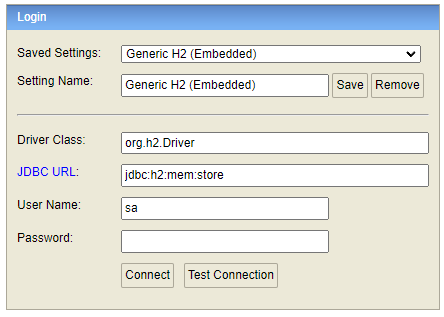

# It's a shop

✅ Реализация интернет-магазина на Spring Boot 3


<hr>

# 1. Технологии

- Java 21
- Spring framework (Boot, MVC, Rest, Data JPA, Security)
- JUnit (Jupiter) + Mockito
- H2 — БД *(in-memory mode)*
- Thymeleaf + HTML/CSS
- Kafka

---

# 2. Запуск с помощью Docker

## 2.1 Инфрастуктура

### 2.1.1 Скачиваем проект

**Команда для клонирования репозитория:**

```
$ git clone git@github.com:Rubaki21/spring-boot-store.git
```

### 2.1.2 Разворачивание инфрастуктуры

В корне проекта находится `docker-compose.yaml`, который разворачивает всю необходимую инфраструктуру. Для запуска необходимо, чтобы был
установлен `Docker`

**Команда для разворачивания инфраструктуры в Docker-контейнере**

Необходимо убедиться, что стоите в корне проекта!!!

```
$ docker compose up -d
```

После выполнения, необходимо подождать около 30 сек, пока создадутся топики или увидеть их в `kafka-ui`

В инфраструктуре имеется `kafka-ui`, который находится по адресу http://localhost:7777. Созданные topic's можно увидеть во вкладке, 
**Topics**

При развёртывании **инфраструктуры**, автоматически создаются 2 топика
1) `out_store.shop_store.products_info`: для загрузки product's из вне
2) `shop_store.out_store.products_info`: результат обработки product's


Важно поднимать инфраструктуру до запуска проекта

## 2.2 Разворачиваем приложение

### 2.2.1 Скачиваем образ проекта

Проект добавлен в **docker Hub**: https://hub.docker.com/r/ereshkigall/store

**Команда для скачивания проекта:**

```
$ docker pull ereshkigall/store:1.0.0 
```

### 2.2.2 Разворачиваем проект

**Важно!!!**

1) Инфраструктура должна быть развёрнута (п. 1.2)
2) Образ проекта должен быть скачан (п. 2.1)

**Команда для запуска проекта в Docker-контейнере**

```
$ docker run -d --name store_app --network=kafka_cluster_local-kafka -e EXTERNAL_GET_PRODUCT_URL=http://localhost:8080/external/products/findAll -p8080:8080 ereshkigall/store:1.0.0
```

`EXTERNAL_GET_PRODUCT_URL` ссылается на **rest endpoint** во внешний источник, из которого могут быть получены 1 или несколько
Products. Если **rest endpoint** отсутствует, то этот параметр можно опустить из команды

Важно для подключения к другому `docker container инфраструктуры` используем параметр `--network=kafka_cluster_local-kafka`

**Готово!** Приложение будет запущено по адресу: `localhost:8080` и имеет доступ к `kafka:9093`

---

# 3. Ручная сборка проекта

**Не обязательный пункт, если необходимо что-то изменить в проекте**

## 3.1 Установка JDK

Для сборки проекта, необходимо установить **JDK 21**

Для установки **JDK**, необходимо выбрать дистрибутив, относительно вашей **операционной системы** https://www.oracle.com/java/technologies/downloads/#jdk21-linux

После установки **JDK**, необходимо прописать `enviroment variable`:

`For Unix`: в bash прописываем `export JAVA_HOME=путь до корня установленной jdk`. Для проверки команда `printenv`

`For Windows`: в cmd прописываем `setx JAVA_HOME "путь до корня установленной jdk"`, для проверки команда `echo %JAVA_HOME%`

При проверке результата, необходимо перезапустить оболочку, т.к. она знает только о тех `enviroment variable`, которые имелись на момент 
её запуска

Пример: 

`setx JAVA_HOME C:\p_env\Java\jdk-21`

### 3.2 Скачиваем и собираем проект

**Команда для клонирования репозитория:**

```
$ git clone git@github.com:Rubaki21/spring-boot-store.git
```

Важно!!! **Убедитесь, что используете **JDK 21** !!!**

**Заходим в корневой каталог проекта и собираем проект. Команда для сборки проекта:**

```
$ ./mvnw clean install
```

### 3.3 Изменение конфигурации `application.yml`

1) Если планируется запускать приложение локально, то необходимо изменить конфигурацию в `src/main/resources/application.yml` заменить
   `bootstrap-servers: kafka:9093` на `bootstrap-servers: localhost:9092`
2) Если планируется собрать `Docker-контейнер` и его использовать, то конфигурацию не стоит изменять

### 3.4 Локальный запуск проекта

**Команда для локального запуска:**
```
$ ./mvnw spring-boot:run
```

### 3.4 Создание `Docker-image` для последующего использования

Необходимо перейти в корневой каталог проекта и создать JAR-файл приложения 

**Команда для сборки проекта**

```
$ ./mvnw clean package
```

**Команда для создания Docker-image**

```
$ docker build -t store .
```

### 3.5 Разворачивание проекта

**Аналогично пункту 2.2.2 Разворачиваем проект, только в конце используется наименование нового образа store:latest**

```
$ docker run -d --name store_app --network=kafka_cluster_local-kafka -e EXTERNAL_GET_PRODUCT_URL=http://localhost:8080/external/products/findAll -p8080:8080 store:latest
```

**Готово!** Приложение будет запущено по адресу: `localhost:8080` и имеет доступ к `kafka:9093`

---

# 4. Логин

Из коробки приложение имеет двух пользователей:

- `admin@mail.com` : `admin`, права `admin`
- `user@mail.com` : `user`, права `user`

---

# 5. Вызов **rest endpoint** во внешний источник

Кнопка вызова находится в админ панели и называется `Загрузить продукты из внешнего источника`


## 5.1 Формат объектов вызываемых в **rest endpoint**

Схеме объекта находится по пути `src/main/resources/avro/product.avsc` по которому формируется объект с полями:

    `title`: наименование объекта (обязательное поле)
    `imageLocation`: ссылка на фотографию (не обязательное поле) 
    `categoryName`: наименование категории (обязательное поле). Необходимо заполнять наименование из уже имеющихся категорий
    `price`: цена (обязательный параметр). Стоимость товара с дробной частью
    `quantity`: количество (не обязательный параметр)

Пример:

    [
        { "title": "товар 1", "price": "21", "categoryName": "CPU", "quantity":"7" },
        { "title": "товар 2", "price": "22.3", "categoryName": "Camera" }
    ]

## 5.2 Формат сообщений kafka

1) `out_store.shop_store.products_info`: потребляет Json коллекцию (от 1 до n продуктов). Схема объекта находится по пути 
   `src/main/resources/avro/product.avsc` по которому формируется объект

    - `title`: наименование объекта (обязательное поле)
    - `imageLocation`: ссылка на фотографию (не обязательное поле) 
    - `categoryName`: наименование категории (обязательное поле). Необходимо заполнять наименование из уже имеющихся категорий
    - `price`: цена (обязательный параметр). Стоимость товара с дробной частью
    - `quantity`: количество (не обязательный параметр) 

Пример:

    [
        { "title": "товар 1", "price": "21", "categoryName": "CPU", "quantity":"7" },
        { "title": "товар 2", "price": "22.3", "categoryName": "Camera" }
    ]

2) `shop_store.out_store.products_info`: сюда кладутся результаты обработки product's. Схема объекта находится по пути
   `src/main/resources/avro/result.avsc` по которому формируется объект

   - `result`: результат обработки product
   - `processingTime`: время сохранения product в БД
   - `productInfo`: объект product, который обработали
   - `exceptionMessage`: ошибка обработки, если она была

Пример:

1) успешная обработка

```
{\"result\": true, \"processingTime\": \"2025-07-06 21:43:54\", \"productInfo\": \"{\\\"title\\\": \\\"мой 2 новый товар\\\", 
\\\"imageLocation\\\": null, \\\"categoryName\\\": \\\"CPU\\\", \\\"price\\\": \\\"22\\\", \\\"quantity\\\": 0}\", \"exceptionMessage\": \"\"}
```

2) не успешная обработка

```
 {\"result\": false, \"processingTime\": \"2025-07-06 21:44:05\", \"productInfo\": \"{\\\"title\\\": \\\"мой 1 новый товар\\\", 
   \\\"imageLocation\\\": null, \\\"categoryName\\\": \\\"CP\\\", \\\"price\\\": \\\"21\\\", \\\"quantity\\\": 0}\", \"exceptionMessage\": \"в базе данных отсутствует категория с именем: CP\"}
```

---

# 6. Доступ к Базе данных

- Запуск происходит по адресу: `localhost:8080/h2-console`
- Доступ имеют только авторизованные пользователи с правами `admin`
- Данные для входа в БД:
    - URL: `jdbc:h2:mem:store`
    - Логин: `sa`
    - Password:` `  (пароль пустой)  
      
- Картинки в БД хранятся в виде ссылок из интернета. Просто скопируйте ссылку на картинку и вставьте её при создании
  товара  
  

### Скриншоты

<p align="center">

<hr>
<p align="center">

<hr>
<p align="center">

<hr>
<p align="center">

<hr>
